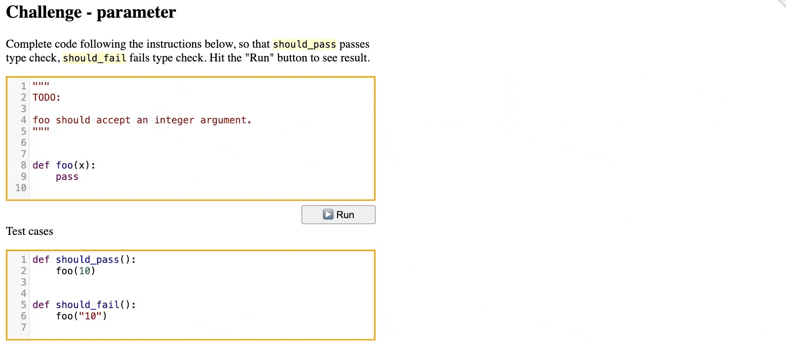

# Python Type Challenges

Master Python typing (type hints) with interactive online exercises!

Click 👉👉 **[HERE](https://python-type-challenges.zeabur.app)** to start



Happy typing!

## How to Run Locally

You can also run the challenge locally. To do that, clone the project and install necessary dependencies, using either PDM or `requirements.txt`.

[PDM](https://pdm-project.org/) is recommended. After [installing PDM](https://pdm.fming.dev/latest/#installation), you can install needed dependencies with the following steps:

```bash
pdm install
pdm dev  # This will run a local Flask server
```

Alternatively, you can install dependencies with `requirements.txt`:

```bash
pip install -r requirements.txt
python -X utf8 -m flask run
```

## How to Contribute

- **Add new challenges**

  Adding a new challenge is pretty simple: **you only need to create a new folder, add a `question.py` and a `solution.py`, and that's it**. See [here](docs/Contribute.md) for a detailed guidance.

- **New features & bug fixes**

  If you want to fix a bug or add a new feature, follow the [guidance](docs/Development.md).

## Got Questions?

For general questions, you can post them in [Discussions](https://github.com/laike9m/Python-Type-Challenges/discussions).

If you met issues or want to suggest a new feature/improvement, feel free to [open a new issue](https://github.com/laike9m/Python-Type-Challenges/issues/new).

## Sponsor

[](https://zeabur.com?referralCode=laike9m&utm_source=laike9m&utm_campaign=oss)

## Credits

This project is inspired [Type Exercise in Rust](https://github.com/skyzh/type-exercise-in-rust/) by [@skyzh](https://github.com/skyzh), and [type-challenges](https://github.com/type-challenges/type-challenges/) by [@antfu](https://github.com/antfu).

Social graph [images](https://unsplash.com/photos/person-sitting-front-of-laptop-mfB1B1s4sMc) come from [Christin Hume](https://unsplash.com/@christinhumephoto).
